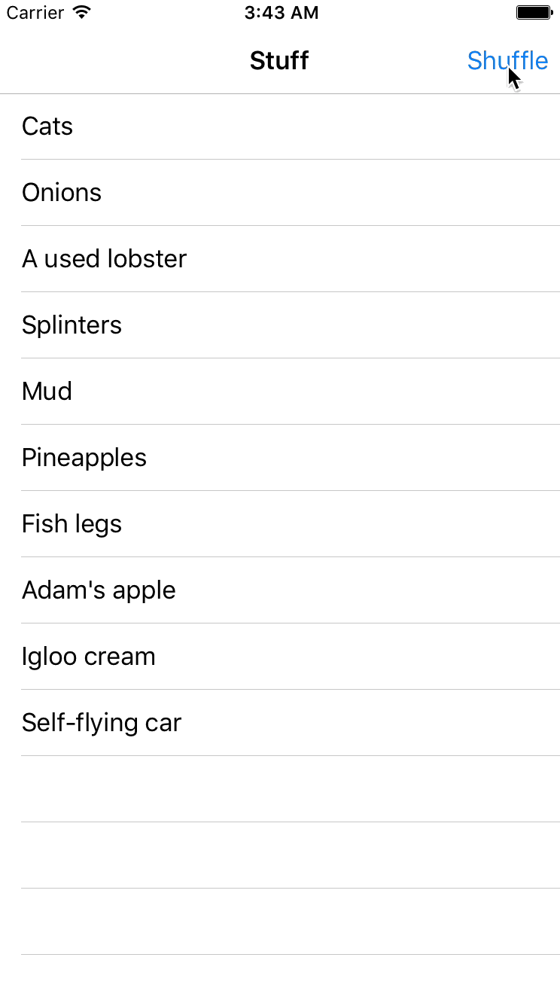

# Dwifft!
## March 15, 2017

---

# 2013

^ Let's go back to 2013.
^ I was the iOS developer at Grouper. This was an app where you and two of your friends would be set up on a blind date with three strangers for drinks.
^ Just finished our migration to iOS 7
^ I want to build all the things.

---


^ So you can imagine with that blind dating setup, things went horribly wrong all the time. So we had this screen where you could chat with one of our support folks. I actually had to look around pretty hard to find a screenshot of the app - I actually got this off an old techcrunch article. Anyway, the new fancy iOS 7 messages app had just come out, and I wanted to make this screen really really nice.

---

```swift
tableView.reloadData() // amateur hour
```



^ One part of that was that I wanted to have nice animated transitions as new messages came in, like in this gif. I didn't want to just call reloadData on the table view, because that can be jarring - it makes you lose your scroll position, for example.

---

```swift
// UITableView

func insertRows(
  at indexPaths: [IndexPath],
  with animation: UITableViewRowAnimation
)
```

^ So, to do that, UITableView has these APIs where you can animatedly insert rows. Unfortunately, in order to do this, you need to explicitly tell it what index paths you want to modify. Usually, you don't really have this information directly available - it'd more be like, OK, I got these new results back from the network and I want them to show up in the table, now what?

---

```swift
// NSFetchedResultsControllerDelegate

func controller(
  _ controller: NSFetchedResultsController,
  didChange anObject: Any,
  at indexPath: IndexPath?,
  for type: NSFetchedResultsChangeType,
  newIndexPath: IndexPath?
)
```

^ So, 2013 me is trying to figure this out, and 2013 me learns about Core Data? As it turns out, NSFetchedResultsControllerDelegate has a really nice API that lines up really well with UITableView. You get these callbacks when your object store changes, and they figure out the index paths for you.
^ That's awesome, I thought, in my infinite 23-year-old optimism - I'll just spin up a core data stack, dump new messages in there, and then retrieve them with my fetched results controller! (It's worth noting, this was my first time using Core Data.)

---

## "Now you have two problems"

^ So, a few thousand crashes later, I ended up pulling this code from the App Store in an emergency update, and just going back to calling reloadData when new messages came in. I wish I knew what the crash was today - it was some kind of multithreading issue, I remember - but at the time it was basically "horrifying core data stacktrace", and I didn't have time to figure it out, and of course it was no big deal and none of this was worth the energy in the first place.

---

# 2015
^ Fast forward to 2015. I'm on a plane from new york to SF, visiting my colleagues at my new job at Stripe. I've been pretending that I know Swift for about a year, and it's becoming increasingly obvious to my coworkers that I don't know what I'm doing, so I decide that I'm just going to spend the flight looking up random algorithms on the internet and trying to implement them in a Swift playground. Party flight.

---

# LCS
### (Longest Common Subsequence)

## **SM**AR**T**P**H**ON**E**
## **H**ARPO**O****N**

^ So one of the algorithms I picked was called the Longest Common Subsequence problem, or LCS for short. The problem states, given two sequences of values, find the longest not-necessarily-contiguous subsequence that they both share. So, for example, if our two inputs are SMARTPHONE and HARPOON, the longest common subsequence is ARPON. I spent way too long trying to come up with a decent word pair to use here.

---

$$
LCS\left(X_{i},Y_{j}\right) =
\begin{cases}
Ø
& \mbox{ if }\ i = 0 \mbox{ or }  j = 0 \\
  \textrm{  } LCS\left(X_{i-1},Y_{j-1}\right) \frown x_{i}
& \mbox{ if } x_i = y_j \\
  \mbox{longest}\left(LCS\left(X_{i},Y_{j-1}\right),LCS\left(X_{i-1},Y_{j}\right)\right)
& \mbox{ if } x_i \ne y_j \\
\end{cases}
$$

<br>
`// I stole this from Wikipedia`

### **SM**AR**T**P**H**ON**E**
### **H**ARPO**O****N**

^ So to explain the LCS algorithm I have this ridiculous LaTEX formula that I stole from Wikipedia that actually isn't that bad when you break it down. LCS is a simple recursive function. You start at the back of both words, and advance two pointers backwards. If both pointers are pointing to the same letter, you add that letter to your LCS. If not, you try deleting the last letter of each word, call LCS again, and take the longer of the two, and you kind of chew down your words that way until they're both empty.

---

# LCS -> Diff

### (-S) (-M) **A R** (-T) **P** (-H) **O N** (-E) -> ARPON
### (+H) **A R P O** (+O) **N** -> HARPOON

^ So, the interesting thing about LCS, that I started to realize on the plane, is that once you have the LCS between two sequences, you've also calculated the minimum series of transformations needed to turn one list into the other. You simply delete all the things from the first sequence that aren't in the LCS, then add all the things from the second word that aren't in it to the LCS, and you have a series of edit transformations.

---

# Dwifft!
## (Swift Diff)

^ At some point, I realized that I had inadvertently solved my problem from back in 2013. This simple diffing algorithm was all that I was missing. If I had had this, I wouldn't have had to rely on this ridiculous core data functionality to get my shiny tableview changes. So, I decided to turn it into a library, and Dwifft was born.

---
```swift
enum DiffStep<T: Equatable> {
  case insert(Int, T)
  case delete(Int, T)
}

extension Array where Element: Equatable {
  func diff(other: [Element]) -> [DiffStep<Element>] {}
}
```

^ So Dwifft is really small - it's basically just two files. The first one is an implementation of the LCS and Diff algorithms described above. It defines an enum for those "edit transformations" I mentioned called a DiffStep, and then extends Arrays of Equatables to be able to diff themselves with arrays of the same type.

---

```swift
class TableViewDiffCalculator<T: Equatable> {
  let tableView: UITableView
  var rows: [T] // calls tableView updates
}
```

^ The second file contains adapters for UITableView and UICollectionView that I call "Diff calculators". You initialize them with a UITableView, and then whenever you set their `rows` property, it'll automatically diff it with its previous value, figure out the edit transformations, map those changes into index paths in your tableview, and then call all the necessary UITableView APIs to perform your animated changes automatically.

---

# Now what?
### (Alternate slide title: Dwifft diff)

^ OK, so now it's about a year and a half later - what's happening with Dwifft?

---

# Vision
### (Alternate slide title: Dwission? Ok, I'll stop)
### ‏‏
### ‏‏
### https://www.stilldrinking.org/programming-sucks

^ I want to read you a passage from a wonderful essay titled "programming sucks" by Peter Welch.

^ Every programmer occasionally, when nobody's home, turns off the lights, pours a glass of scotch, puts on some light German electronica, and opens up a file on their computer[...] They read over the lines, and weep at their beauty, then the tears turn bitter as they remember the rest of the files and the inevitable collapse of all that is good and true in the world.

^ This file is Good Code. It has sensible and consistent names for functions and variables. It's concise. It doesn't do anything obviously stupid. It has never had to live in the wild, or answer to a sales team. It does exactly one, mundane, specific thing, and it does it well. It was written by a single person, and never touched by another. It reads like poetry written by someone over thirty.

^ I want Dwifft to be this for me.

---

# In practice


- Simplest possible implementation (unix philosophy)
- 𝚫 -> 0
- 100% documentation, test coverage
- close most PRs
- minimize dependencies

^ So, what does that mean? It means that its featureset will not grow unnecessarily over time, and will ideally shrink. As it turns out, most pull requests people open are to add new convenience methods and stuff, which I unfortunately systematically close. This also sounds kind of obvious I guess, but I never ever want Dwifft to break. This implies writing lots of tests and making sure it's fully documented. As part of both of the above, it's essential that it have as few dependencies as possible - just ask all the people that depended on leftpad.js. So, the only dependency for 80% Dwifft is Swift itself - there's just a little bit that pulls in UIKit, and that's it. Obviously, no third-party dependencies. And, as curmudgeonly as I know I sound, the Swift dependency is actually really annoying - it sucks having to update the library with every new version of Swift.

---

# Announcing Dwifft v0.6!

```swift
class TableViewDiffCalculator<S, T> {
  var rows: [T] // deprecated!
  var sectionsAndRows: [(S, [T])] // THE FUTURE
}
```

^ So, to directly contradict what I just said, I actually have some exciting news - this week I'll be releasing Dwifft 0.6.
^ Yes, someday you'll tell your grandkids, I was there when Dwifft 0.6 was announced.
^ I said the goal is the simplest implementation possible, and I think this new functionality is required for Dwifft to feel complete. The biggest change is that now instead of just diffing arrays, you can diff arrays of arrays. But the magical thing is that now Dwifft can use this to add and remove sections to your tableview or collectionview, not just rows. You might be wondering, what's with that weird array of tuples thing. It's kind of awkward to write, but all it is is an ordered dictionary. This was originally just an array of arrays of T, but that had to change because sections themselves have meaning - so, you might imagine a case where a section needs to be renamed, but none of its contents change.

---

```swift
// Oh god no
([[T]], [[T]]) ->
(Tree<T>, Tree<T>) ->
TreeDiff<T> ->
ArrayDiff<T>

// Yes yes yes
([(S, [T])], [(S, [T])]) ->
([RowOrSection<S, T>], [RowOrSection<S, T>]) ->
ArrayDiff<S, T>
```

^ This was a really interesting change - I had this massively complicated strategy for doing this that I was sort of planning for like a year. I was going to change the diff algorithm into a tree diffing algorithm, then write code to effectively transform a 2D array into a tree, so that we could do diffs of arbitrary depth. But that was going to be really hard. And then my friend Jeremy idly suggested over breakfast, why don't you just treat the section boundaries themselves like array elements? So, just flatten your 2D arrays of sections and rows into 1D arrays that contain some objects, and some "section placeholders". Then diff those 1D arrays. That, as it turns out, is totally doable, and how this works.

---

# To 1.0

- ~~`sectionsAndRows`~~
- Coalesce delete/insert operations into moves
- macOS + tvOS targets
- Swift ABI stability (ha ha)
- (hopefully) done forever

^ So, what is next? Ideally, it's just these three things: first, I'd like to support "move" operations in addition to insertions and deletes, which would probably mean taking an array of those DiffSteps and coalescing them into moves. This is because UICollectionView can have different animations for items being deleted/inserted instead of simply moving around.
^ Next, I'd like to make sure this works on every relevant Apple platform, which includes macOS and tvOS (I'm not a watchKit expert, but I don't think it has any concept of animated table changes, but would love to hear if I'm wrong about that.)
^ Then, ideally, Swift 4 would have ABI stability, so I could stop updating this library when new Swift versions come out, and then it can be done forever!


---

# Thank you
- @jflinter
- Dwifft: github.com/jflinter/dwifft
- This talk: github.com/jflinter/talks/tree/master/dwifft\_bk\_swift
- Questions?
