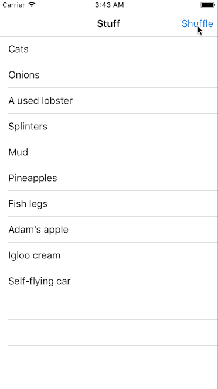
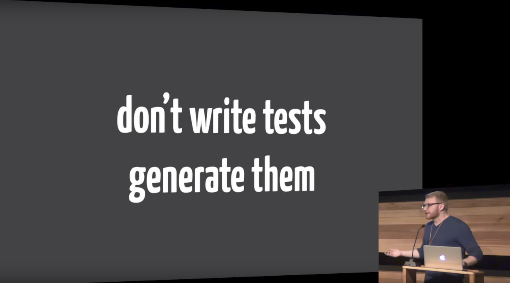
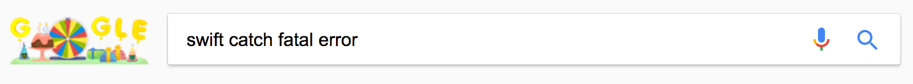
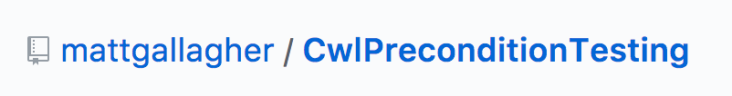

## Hello!
### Jack Flintermann
### @jflinter

^ Hi! My name's Jack. I'm an engineer at Stripe. But today I want to tell you about something totally unrelated to my day-to-day work.

---

## jflinter/dwifft

^ So, in my free time I work on this library called Dwifft.

---

```swift
enum DiffStep<T> {
  case .insert(T, Int)
  case .delete(T, Int)
}

func diff<T>(a: [T], b: [T]) -> [DiffStep<T>] {
  // hello
}
```

^ The core of this library is just a single function called `diff`. It lets you take 2 arrays, and diff them. The output is a series of transformations, that when applied to the first array, will result in the second array.

---

```swift
diff(
  ["C", "A", "T"],
  ["F", "A", "C", "T", "S"]
) == [
  .delete("C", 0),
  .insert("F", 0),
  .insert("C", 2),
  .insert("S", 4)
]
```

^ This makes a little more sense with an example. Let's say I want to turn the word CAT into the word FACTS. We'll represent the two words as arrays of characters and then diff them. Dwifft will then tell me that I should delete the character C at index 0, then insert an F at index 0, a C at index 2, and an S at index 4. Thanks for subscribing to cat facts!

---

```swift
class TableViewDiffCalculator<T> {
  let tableView: UITableView

  // when set, animates changes onto `tableView`
  var rows: [T]
}
```

^ The library also exposes wrappers for UITableViews and UICollectionViews to automagically animatedly insert and delete rows as an array of values changes. So like if you have an array of messages or tweets or whatever that you're pulling from a server, you can just set each new value on this "diff calculator" object, and it'll automatically make the right calls to insertRows and deleteRows on the table view for you.

---



^ The library ships with a little example app to show this off - it generates a random array of strings and displays them in a table. When you tap "shuffle", it'll make a new random array, and animatedly switch the table to display them.

---

# Testing

```swift
XCTAssertEqual(
  diff(
    ["C", "A", "T"],
    ["F", "A", "C", "T", "S"]
  ), 
  [
    .delete("C", 0),
    .insert("F", 0),
    .insert("C", 2),
    .insert("S", 4)
  ]
)
```

^ So I told myself early on that unlike every other side project I had worked on, this time I was going to do a really good job testing my library. There's a lot of finicky index math, and any mistake means an immediate app crash.
^ So I wrote some unit tests! They all basically looked like this - you start with some known inputs, and compare them to some known outputs. So our cat facts example from before makes for a decent test here.

---

## Conflict arises

^ About 6 months ago, I started rewriting the core diff algorithm to make it use less memory. But then something really strange started happening - my unit tests were passing, but the example app i wrote would occasionally crash. It was hard to reproduce this - you'd just get unlucky with the two arrays you got, and the app would crash. This made me feel very worried, and I sunk into a deep despair.

---



^ My anguish and despair became so deep that I slipped into kind of a hallucinatory mania. I had an incredibly vivid flashback to the first functional swift conference, all the way back in 2014, where I watched a really fantastic talk by Brian Gesiak about something called Property Based Testing. I'm going to give you a quick and dirty recap of it, and it's going to lack all of Brian's wit and charm, so if you like this next part, you can go to the old conference site and watch Brian's talk. I'll have a link to it at the end. Nice job, 2014 Chris and Brandon.

^ Ok, so what is property-based testing. I really like Brian's crazy pitch for property-based tests - don't write unit tests, generate them. What if you could automatically generate every possible unit test for your function, and not have to write things like that cat facts test?

---

```swift
func sort(input: [Int]) -> [Int] {
  // not shown: beautiful, beautiful code
}
```

^ Let's do a little demo. Let's imagine, for some reason, we've written a function that sorts an array of integers. How can we test this?

---

```swift
func testSort() {
  XCTAssertEqual(sort([3, 2, 1]), [1, 2, 3])
}
```

^ Well, this is an OK start. But what if there's some bug in our sorting code that breaks with negative numbers? Or zero? Or when there are duplicates in the array?

---

## Properties of `sort`

* The output has the same length as the input
* Every element in the input is in the output
* The output is in ascending order

^ Instead, let's take a step back, and think about the properties of our sorting function. What should always be true of the output of this function, regardless of the input? Well, the output should always be the same length as the input. Every element in the input should be present in the output - our sorting algorithm doesn't delete anything. And, all of the elements of the output are in ascending order.

---

```swift
for input in everyPossibleArrayOfIntegers() {
  let output = sort(input)
  
  XCTAssertEqual(input.count, output.count)
  
  for i in input {
    XCTAssert(output.contains(i))
  }

  for i in 1..<(output.count - 1) {
    XCTAssert(output[i] <= output[i + 1])
  }
}
```

^ It's pretty easy to just convert those three properties I just described into code. All that we need is a magic function called everyPossibleArrayOfIntegers, that returns, well, every possible array of integers in the universe. Then for each one we can verify that all these properties of sort hold up. If we could have this magic function, we could actually prove the correctness of our sort function. Obviously it's not feasible to generate every array of integers, but it's feasible to generate a lot of them! We can at least write a function called "lotsOfArraysOfIntegers". That function will generate and return thousands and thousands of arrays of integers. Because it's a computer doing it, and computers lack many human flaws, this function won't forget to include edge cases like zero and negative numbers. And so, if this test passes, even if we have to settle for lotsOfArraysOfIntegers instead of everyPossibleArrayOfIntegers we can still be really really confident in the accuracy of our sorting algorithm.

---

```swift
func sort(input: [Int]) -> [Int] {
  if input.contains(0) {
    fatalError("uh oh")
  }
  // etc
}

// [3, 2, 1] -> success!
// [4, 5, 5, 3] -> success!
// [6, 0, 4] -> failure!
// [6, 0] -> failure!
// [6] -> success!
// [0] -> failure!
// [] -> success!
// return [0]
```

^ But wait, there's more! Let's say we actually did make a mistake in our sorting function. I've added a really subtle edge case bug into the sort function here, see if you can spot it. So let's say we've started to loop through our lotsOfArraysOfIntegers, and we're cruising along. First we finds a couple of arrays that work! But then we eventually find one that doesn't - [6, 0, 4] will fail because it contains a zero. Well, because our bug is super subtle, it might not be immediately obvious to us why that failed but the example before it succeeded. So we can boost the signal from our test a bit by doing something called shrinking. First, let's try dropping the last element of the failing array, and see if that fails too. Then let's keep doing that until we get to a minimum failing test case. So you can see, from [6, 0, 4] we drop 4 to get [6, 0], then drop 0 to get [6], which works, so we try dropping the front of [6, 0] to get [0], which fails, so we try the empty array, which succeds, so an array with just [0] in it is our minimum failing test case. And now it should be way more obvious what's wrong in our sort function.

---

# What's in the box?
* Generators
* Shrinkers
* DSL for defining properties

^ So as it turns out there are a bunch of property-based testing libraries out there. They started with a Haskell library called QuickCheck, and that's now been ported to basically every language, including Swift. Swift has a few of them, I'll be using one called SwiftCheck in the rest of the talk because it came up first in my google search. So these libraries all give you roughly three things. They give you functions to generate lots of test cases, and functions to compose those generators. So you can take a generator that gives you a random integer, and use that to get a function that gives you an array of random integers. And then you can compose two of those to get a tuple of two random arrays of integers, etc. They know how to shrink failing test cases down to give more meaningful failures. And they usually give you some kind of DSL for defining your properties and integrating them with your test runner, like XCTest.

---


^ So, back to my problem. Having remembered all of this, I jolted out of my flashback and realized, conceptually, my example app is a really slow, mediocre property-based test for Dwifft. You push the shuffle button to generate every possible array of strings, and then you're verifying the property that the app doesn't crash! So I set out with the goal of making this really crappy test faster and better. I feel like displaying this gif during a functional programming conference is some kind of major life achievement.

---

```swift
import SwiftCheck

func testWithSwiftCheck() {
  property(
    "App does not crash"
  ) <- forAll { (a : [Int], b : [Int]) in
    let tableView = UITableView()
    let calculator = TableViewDiffCalculator(tableView: tableView)
    calculator.rows = a
    calculator.rows = b
    return true // if we haven't crashed by now, succeed!
  }
}
```

^ First I looked into what libraries existed to do this in Swift. The two most compelling-seeming ones were called QuickCheck and Fox. I ended up using QuickCheck because it ranked higher in the Google search results.

^ Here's what my first test looked like. You can see how SwiftCheck exposes this kind of funky DSL with custom operators and stuff for naming and then defining your properties. In this case, we just give it a way to verify the property - make a new UITableView, generate two random arrays, and animate both arrays onto the table. All we care about at this point is whether or not the app crashes. The good news was, this test did reproduce the issue I was seeing. But the bad news was, it wasn't giving me a great failing example, because it couldn't shrink the result. It couldn't shrink the result because it was crashing before it could do that! In this case, I was getting an array out of bounds error in my diffCalculator. So, at this point I did what any sane person would do...

---


<br>


^ And googled "swift catch fatal error"! And this led me eventually to a really interesting blog post by Matt Gallagher, who writes the blog cocoa with love. He's got a really crazy black-magicky strategy for handling mach exceptions that effectively lets you catch swift fatalErrors, which is massively useful here. I'll link to the blog post at the end of the talk; it's way too long to talk about here.

---

```swift
func testWithSwiftCheck() {
  property(
    "App does not crash"
  ) <- forAll { (a : [Int], b : [Int]) in
    return catchingFatalErrors {
      let tableView = UITableView()
      let calculator = TableViewDiffCalculator(tableView: tableView)
      calculator.rows = a
      calculator.rows = b
      return true // if we haven't crashed by now, succeed!
    }
  }
}
```

^ So this test finally worked! It ultimately highlighted a really subtle nuance in UITableView. Without getting too into it, when it's inside an update block, UITableView always handles deletions before insertions, regardless of the order you actually call them, so my new logic was returning indices that UITableView didn't expect under certain orderings of insertions and deletions. It was actually kind of a happy accident that my original code didn't have this issue.

---

```swift
func apply<T>(diff: [DiffStep<T>] toArray a: [T]) -> [T] {
  // hello again
}

let a = [1, 2, 3]
let b = [4, 2, 1]
let result = diff(a, b)
let applied = apply(a, result)
b == applied
```

^ So I fixed things up, and was feeling pretty good about how things were going, and decided to write more tests. At this point I had done some reading on property-based testing, and someone had suggested that reversible functions are really nice to test this way. So if you're writing a JSON encoder, you can also write a JSON decoder, and then generate a ton of test cases that ensure that encoding and then decoding an object always leaves you back where you started. So I needed a way to effectively invert my diff function, which I did with a function called `apply`. This takes a series of DiffSteps and applies them to an array. So if you diff two arrays, and then apply that diff to the first array, you should get the second array.

---

```swift
func testDiff() {
  property(
    "Diffing 2 arrays & applying the diff" +
    "to the first yields the second"
  ) <- forAll { (a : [Int], b : [Int]) in
    return catchingFatalErrors {
      let diff = diff(a, b)
      return apply(diff: diff, toArray: a) == b
    }
  }
}
```

^ And once I have that function, the test almost just falls out on its own. I can generate a jillion arrays of integers, diff them against each other, and make sure the diff applies. I really like this test, because it feels like the name property-based testing really applies here: you're just describing a property of your algorithm and letting the framework verify it for you.

^ Writing these tests also opened my eyes to something I hadn't really realized before, which is that my library was slow as hell. All of my unit tests were testing these like trivially small cases, but now SwiftCheck was throwing arrays with thousands of integers in them at it, and it was grinding to a halt. I ended up investing a ton of effort into making it faster, and still have more work to do, but I thought this was a really neat observation. Just like I mentioned earlier, where you might have just forgotten to test your sorting algorithm with a negative number or something, I had never thought to write a benchmark or unit test that diffed two enormous arrays. So, it might have just been a happy accident, but I thought it was really cool how SwiftCheck helped me notice this about my code in a way that I might not have otherwise.

---

## OK WE'RE ALMOST DONE

^ So now having had the benefit of being able to look back on this experience, here's a quick summary of how I feel about testing my code this way.

---

## THE BAD NEWS
### Property-based testing is hard.

^ So yeah, the bad news is that property-based testing can be hard. And specifically, it can be hard to get started with. It took me three years to do anything with it after I first heard about it. It's a shift in thinking to say, "what are the properties of my code that I'm trying to verify?", and which ones you should test first.
^ I think this is reminiscent of the old days of iOS development, where unit testing iOS code wasn't really a thing for a while. It was always really hard to write the first unit test for your app, but once you got one, the next one was easier to add. I'd recommend doing the same thing here - your first property-based test can just be that your function doesn't crash! If you do that, I'd highly recommend doing it in conjunction with the CwlPreconditionTesting library I mentioned.
^ From there, you can kind of follow your gut. If you have reversible operations, like diff and apply, or JSON serialization and deserialization, that can be a great thing to test this way. And if you're having a hard-to-reproduce crash, that is triggered by some weird combination of state, think hard about trying to diagnose it using a test like this.

---

## THE GOOD NEWS
### Property-based testing is worth it.

^ And so if the bad news is that it's hard, the good news is that it's worth it. You get an unbelievable sense of security around your code. It's like the feeling you get where you're working on code that doesn't have any unit tests, and then you write them and feel much freer - you feel like that again when you're working on code that has unit tests and you add property-based tests. Your tests will point out flaws you didn't even know your code had, like forgetting to handle zero in your sorting algorithm. And tests like this let you verify complicated or weird systems like Dwifft, which is a lot stronger for having them.

---

## THE END

* github.com/jflinter/dwifft

* 2014.funswiftconf.com/speakers/brian.html

* github.com/TypeLift/SwiftCheck

* cocoawithlove.com/blog/2016/02/02/partial-functions-part-two-catching-precondition-failures.html

* github.com/jflinter/talks
