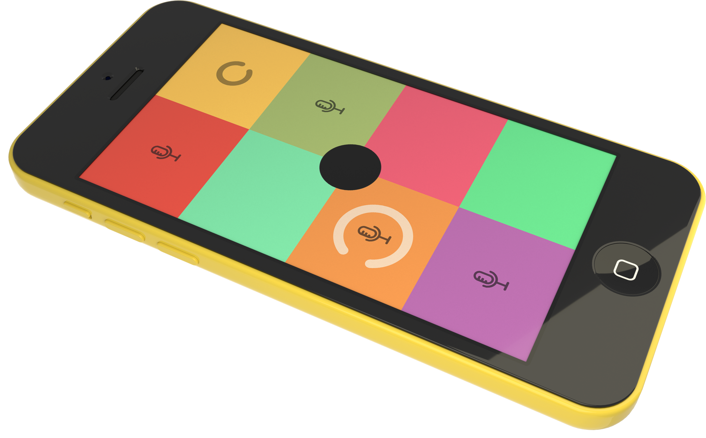
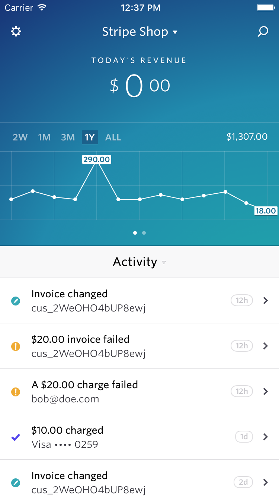
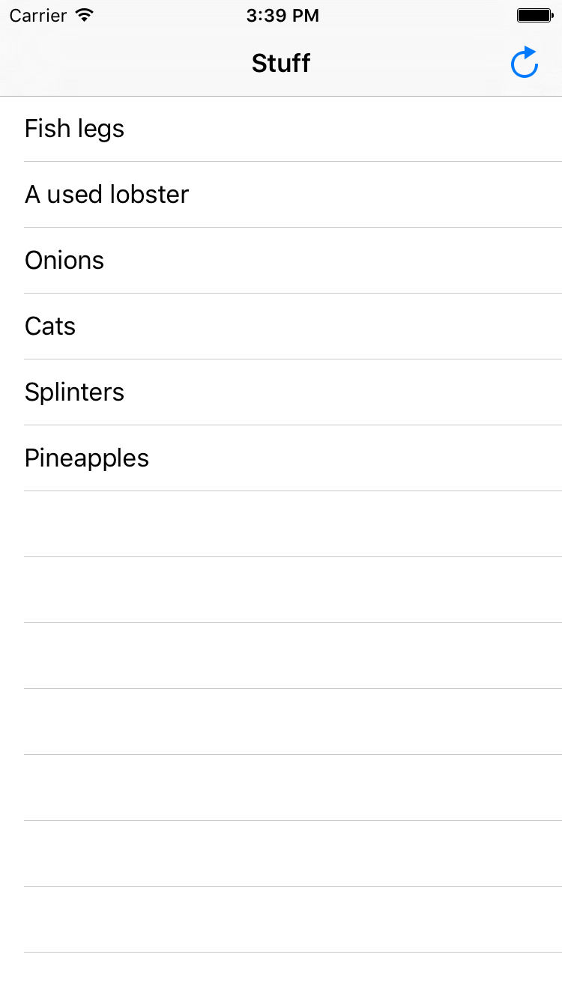
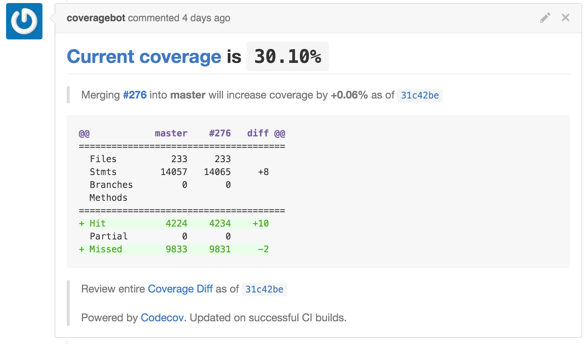

# Testing: a Tool for Humans

### Jack Flintermann

^ Hi! Thanks for coming. I'm Jack Flintermann, and I'm an iOS engineer at Stripe, which is an online payments company based in San Francisco.

---

# Why am I here?

^ So, I want to do a tiny little warm up and survey here.

^ Everybody put 2 hands up in the air. Get a nice stretch in. To the left, then to the right.

^ 2 hands up if you've ever written a test for your code, 1 hand up if you've ever enjoyed doing it

^ 2 hands up if you've ever written an iOS app. 1 hand up if you've ever written a test for an iOS app.

^ I'm not sure about NUS, but noone really ever explained software testing to me that much in college. So I just want to give a quick overview of a few things I've learned about tests since then.

---

# tl;dr
### Tests are a tool that are meant for _*you*_ as a means to save you time and make you less stressed. That's it.

^ At the beginning of my career, I thought of tests as an external requirement that was handed down by either my professors or bosses, that I sort of had to "fill out at the end" of doing a project or feature. Like, I would write the code for my project, and then add some tests at the end in order to get a good grade. But really, they're just meant to make your life as a software developer better.

---

# Why bother writing tests at all?

---

## Tests make changing your code _not terrifying_

^ So, this is probably the most obvious example, but tests can validate that your code is doing what its supposed to, and make sure you don't accidentally break your code.

---



^ As one extreme example, I worked on a music app last year called Keezy. It had a really beautiful UI, but had been quickly built as a prototype, so when I opened up the code and inside was just... bees. Bees and string. So I wanted to clean things up internally, but not change the way the app worked at all. So the first thing I did was write this insane little series of integration tests that simulated button presses on the app and then compared the resultant contents of the screen to a bunch of screenshots I took ahead of time. Now, make no mistake - these were the worst tests ever. They took forever to run, and would break if you looked at them funny. I seriously considered removing this slide because I don't want to suggest that this is generally a good idea in any way. But those tests totally did their job. So really, these tests were meant to emphasize the third strength of tests I mentioned above, which is that they made it safe to change the underlying code without changing the behavior of the app.

---

## Tests make you _write better code_

^ If your code relies on crazy side effects or random behavior to work, it's really hard to write tests for it. Testable code ~= understandable code. So if you hold it as invariant that you need to have good tests, you're sort of forced to write better code.

---



^ As a counterexample, the app that I currently work on is a dashboard for your Stripe account. It'll show you things like how much money you made this week, and notify you when you have new payments and customers and such. For this app, because it's fairly large and complex, we wanted to avoid a common pattern in iOS apps, which was to have almost all of the code live inside what are called UIViewControllers. We wanted to encourage ourselves to write more well-defined classes, so we took advantage of a nice feature of UIViewControllers which is that they're really a pain to test. So here, if we wanted to have good test coverage, etc, we were kind of forced to write decent code. So here, in addition to all the other benefits of testing, we're particularly interested in the second point I made above, which is that our tests are literally helping us write better code.

---

# Massive View Controllers

^ I want to go on a little tangent, and dig into this a bit more with an example, since like I said this tends to happen all of the time in iOS apps. I like calling this problem Massive View Controller. People like to talk about iOS apps following the MVC pattern, aka Model View Controller. And to a large extent this makes sense: my Model logic should go in Model classes, my UI stuff should live in View classes. What's the controller for? Everything else!

---



^ So let's imagine we want to write a screen that talks to the network, parses out some stuff from the response, and displays that stuff in a list. What kind of stuff? Who cares.

---

```swift
class StuffViewController: UIViewController,
                           NSURLSessionDataDelegate,
                           UITableViewDataSource
```

^ So the quickest and dirtiest way to do this is to write classes like this (I have personally written tons of code like this): you have a ViewController subclass that implements a bunch of different protocols. In this case, we have a thing that fetches data from the network and displays it in a table view. For those of you not familiar with iOS, a protocol is the same thing as an interface in Java. So this thing has a TON of responsibility.

---

# NSURLSessionDataDelegate
## Fetches things from the network

```swift
func URLSession(session: NSURLSession,
    dataTask: NSURLSessionDataTask,
    didReceiveResponse response: NSURLResponse,
    completionHandler: (NSURLSessionResponseDisposition) -> Void)
```

^ So this part of our BigViewController knows how to talk to the network, by implementing the NSURLSessionDataDelegate protocol.

---

# UITableViewDataSource
## Populates a UITableView

```swift
func tableView(tableView: UITableView,
  cellForRowAtIndexPath) -> UITableViewCell
```

^ And this part populates the table view with information

---

# A better way

^ So the problem is, in addition to being really complicated, this class is really hard to test. Like, what tests do you even write for it? I like to say that a test should validate that a thing does its job. But this thing is so complex, that it's not really clear what its job even is!
^ So the answer here is, each one of those responsibilities should be a class in and of itself. And then each one of those classes can be tested individually.

---

```swift
class APIClient: NSURLSessionDataDelegate {
    func fetchURL(url: NSURL,
    success: (NSHTTPURLResponse -> Void),
    failure: (NSError -> Void))
}

class APIDeserializer {
    func parseURLResponse(response: NSHTTPURLResponse)
    -> [Row]
}

class NetworkedTableViewDataSource: UITableViewDataSource {
    func init(tableView: UITableView,
              apiClient: APIClient,
              deserializer: APIDeserializer)
}

class StuffViewController {
    init(dataSource: NetworkedTableViewDataSource)
}
```

^ So here you can see - we've broken out all this logic into 3 new lightweight classes: one thing, APIClient, that talks to the network, and knows how to "speak" HTTP. One thing, APIDeserializer, that knows how to take a JSON response and parse it out. And one thing, a NetworkedTableViewDataSource, that knows how to provide rows to a table view. And, writing tests for these things is trivial! You can make sure that the first thing returns a correct error if the network returns a 400 response. You can give the second thing a JSON file and make sure it reads it correctly. You can make sure the third thing returns correctly-set-up table view cells. And now, our StuffViewController is really really small, and we can test it by handing it some dummy data and making sure that it draws it correctly. So you can see here, that by deciding to make this class more testable, we've also made it much easier to understand and change later. Again, tests are basically forcing us to write better code.

---

# Adding tests to an untested project: the algorithm

1. Write a test. Literally, any test.
2. Write more tests.

^ So, to wrap things up, I want to get a bit more practical. A really common thing that happens in software engineering is that you come to an untested codebase, and you might have nodded your head at my entire talk, but you still have no idea where to begin. Honestly, the hardest test to write when you're in this situation is the first one. So it's good psychologically to start with something really small to build some early momentum.

---



^ A good way to keep your momentum going with tests is to measure your code coverage - this is a neat process where you build a special version of your program that automatically inserts annotations at each line of code. Then, as your tests run, it checks off which lines of your program are actually ran as part of running your tests. Engineers are super good at trying to make numbers go up, so this tends to sort things out really well. For the iOS dashboard app I showed you earlier, we actually use a service called Codecov that appends a little coverage report to all of our pull requests. This is a nice gentle encouragament to always be making the coverage number go up, even if it's like .06% at a time.

---

# Test-driven Development (TDD)

Given a problem,

1. Write a bunch of failing tests that describe your intended behavior
2. Write code until all the tests pass
3. Refactor until the code is good

^ So, another good way to keep that "adding tests" momentum increasing is to pursue something called "test-driven development", which really just means "writing your tests before writing your code".

---

# Job interviews

Test-driven-development is a _really nice_ way to do job interviews, but almost noone does it

- Specifications give you time to think
- Tests give you confidence
- Tests immediately highlight issues in your code

^ There are two little moments that are common to most job interviews I've given (and done):

^ - The interviewer finishes asking you their question, and it's time to write code, and even if it's easy, your mind is freaking out. Now is a great time to write a few tests! It's also a great way to make sure you understand the question - a lot of times, interviewers are looking to make sure that you consider all of the edge cases, and this makes that really easy!

^ You're finished with the first bit of code-writing, and you have your function that reverses a linked list or whatever, and you show it to them, like "here you go!" and you both sort of pause, like, "now what?" At this point I usually ask a candidate "ok, does it work?". Most people then proceed to sort of awkwardly run their code a few times with different hard-coded inputs. It's so nice to instead be able to just point to your already-passing test suite and skip this moment altogether.

---

# Nothing too heavyweight

```ruby
# interview.rb

class MyInterviewClass
  def time_left_in_talk(time)
    return "This talk is over in #{time} minute"
  end
end

raise "This is wrong" unless time_left_in_talk(1) == "This talk is over in 1 minute"

# to run this, just `ruby interview.rb`

```

^ For the purpose of an interview, "test case" can really just mean "a few lines of assertions" at the bottom of the file - you don't need to go overboard. It takes just a few seconds to write that test at the bottom. The big difference is just that you write it _before_ the MyInterviewClass class!

---

# More Reading

- http://khanlou.com/2015/12/massive-view-controller/
- https://realm.io/news/andy-matuschak-refactor-mega-controller/

---

# Thank you
### @jflinter

^ So, that's all I've got - I hope that was helpful. I left things sort of intentionally high-level here since presumably a lot of you come from different backgrounds, but I'd be happy to focus on anything more specifically if there are any questions. I'm also happy to answer any questions about Stripe, or iOS development in general.
