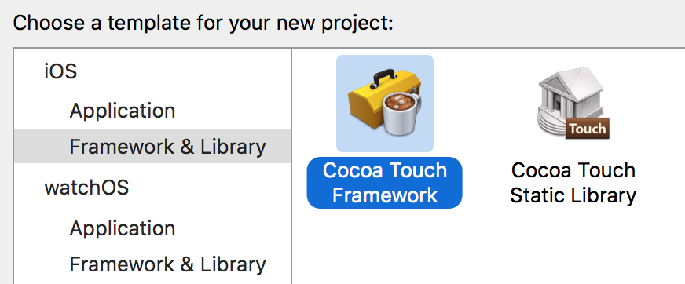
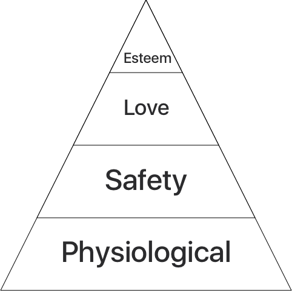
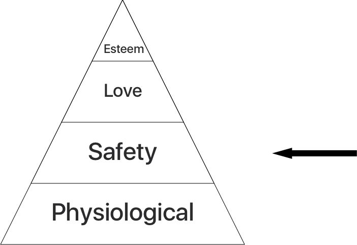
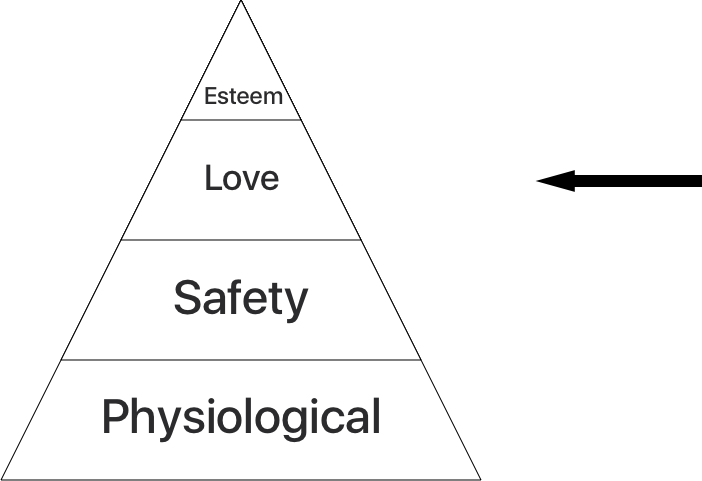
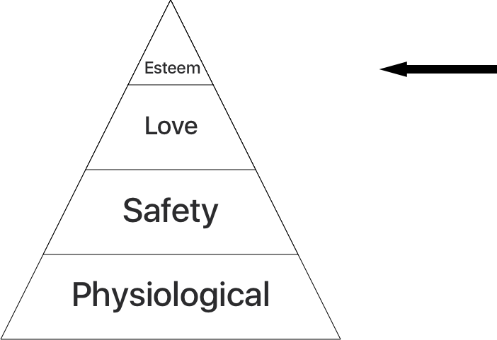

# NEEDS
### September 12, 2016

^ Hi! I'm Jack Flintermann. Thanks for coming, and thanks to Yodle for hosting. I'm an iOS engineer at Stripe, and I'm here to talk to you about needs.

---

^ So, if you're not familiar with Stripe, we're a payments company for developers. We make it easy to accept payments on your website or your app. As part of that, we have an iOS SDK that you can use to work with our API.

---

^ This has been my first time working on an SDK instead of an app. My first time not choosing "iOS Application" from the Xcode new project page. Now, from a terminology standpoint, I use the term "SDK" to mean a software library that's distributed as part of a larger service. And in this talk I want to highlight some of the interesting differences and challenges we've seen when developing our SDK compared to working on an app. So, think about the last time you were trying to decide whether or not to use an iOS library. Maybe Alamofire, or RxSwift, or 320. Ok, hopefully not 320. What was your thought process like? At the simplest level, you were thinking about your needs. And so, as an SDK maker, you're really just trying to meet your users' needs.

---

^ My talk has a pyramid too! I think a good way to translate that idea into something actually useful, is Maslow's heirarchy of needs. This is a psychological framework developed by Abraham Maslow in 1943, and like most psychological frameworks from that era, it has tons of things that are super problematic and is primarily just useful as a metaphor in talks like this.

---

^ So, the most foundational thing in the heirarchy - the thing that you can't have anything else without - are physiological needs. Food. Water. Oxygen. In order to have anything nice in life, you have to first be alive. Really deep stuff here tonight, folks.

---

# Installation

^ And I think the analogy here, to an SDK maker, is installation. People can't even consider using your SDK if they can't install it. This sounds trivial, but we've spent a really surprising amount of effort here to make sure it's as easy as possible to install the Stripe SDK and keep it up to date. I'll tell you about some of the challenges here.

---

# Support ~everything.
- Cocoapods
- Carthage
- .framework

^ First, you have to support every possible way your users might want to install your SDK. This, at the minimum, means adding Cocoapods support, and providing an Xcode target to build a Cocoa Touch framework (which implicitly gives you support for Carthage as well). We actually have a few other targets we support at Stripe too, like Fabric from Twitter.

---

# (Modern) Objective-C.

^ Next, simply put, given the ongoing changes in the Swift language itself, if you have any regard for your own sanity you really just have to write your SDK in Objective C. Which is unfortunate, because swift is pretty great. That said, you want things to feel natural for people that are using your objective-c SDK inside their swift app. Apple has added two features to Objective-C for this exact purpose: nullability annotations and objective-c generics. I'm not going to go super in-depth on them, but basically they help Apple's internal objective-c-to-swift translator understand your code better. Using them in an app is sort of an optional, nice-to-have kind of thing, but in an SDK they're essential.

---

# No dependencies.

^ The last hard thing about installation is that because people install your SDK via different means, you also can't use any third-party code. The exception here, which is an enormous pain, is if you "vendorize" code - i.e. you replace all of the class prefixes, and manually audit the code you want to use to make sure it would play nicely if someone else were using that code in their app. It's a ton of manual work, and we've only done it once ever in the Stripe SDK, with Peter Steinberger's awesome Aspects library.

---

^ So, now that we are alive, and our SDK is installed, we can move onto the second need in the heirarchy - safety. This translates pretty literally to SDK world - people want to be sure that your SDK isn't going to crash their app. There are a few essential ways to do this.

---

# Make it open-source.

^ This is by far the easiest way. Let developers peruse the source at their leisure. If they really really want to, they can fork it and change stuff they don't like (although you don't want them doing this, because it makes it harder to get them to upgrade and use new features).

---

# Write lots of tests.

^ So, this should seem obvious. You should absolutely adopt a test-first mentality. The standard for your code is just way higher here. If you write a bug in an app, you see a few crashes. If you write a bug in your SDK, you see an enormous amount. So, I don't want to say "this is how you test an SDK" because it's different for every SDK, but it's essential that you conciously have that conversation, and make a decision about what kind of tests you need to have to be certain you don't ship bugs to your customers.

---

### `__IPHONE_OS_VERSION_MIN_REQUIRED`

^ We also have started to write a few unconventional tests. First, since our SDK supports back to iOS 7, we're super careful to not accidentally use an unavailable API. We use a really fantastic linting tool called FauxPas to enforce this, which integrates right into our Xcode and CI builds.

---

# Installation Tests

^ We actually also write CI tests to make sure installation methods don't break. We basically think of them as unit tests for our Xcode project and podspec. These tests basically create a brand new iOS app, install the Stripe SDK into it by various means, and then run that app's test target. (These tests break all the time, and catch tons of failures.) We've also recently started running these for even more configurations - for example, since iOS 10 adds Apple Pay support to the watch, we now make sure our SDK integrates correctly with watch apps.

---

^ Ok, we're alive and we're safe. Our SDK is installed and doesn't break. Moving up the pyramid, then, we get to your users' desire to feel loved, and a sense of belonging. And I think two of the best ways to make them feel that way is to have really thoughtful API design and documentation.

---

# API design

^ So, what makes a good API is a huge subject that could definitely span multiple talks, but the point I want to communicate is just that you should try and make APIs that not only let your users build the thing they want to build, but feel good as they do it. Here are just three things I want to highlight that we think about with the Stripe SDK.

---

# Small API surface

^ The first is that for your own sanity, you should keep your API surface small so that you can change things later without breaking peoples' code. For this, we basically just do what Apple does with their frameworks: keep as many of the headers private as possible. This way, you can change most of your code without worrying about breaking stuff.

---

# Atoms, not molecules

^ Another thing I want to suggest is generally to try and ship atoms, not molecules. iOS developers love tweaking things, and so it's generally better to give them lots of little classes that they can assemble in interesting ways than a few large, monolithic classes. For example, the Stripe SDK gives you a nice payment view controller class that collects your user's card details and sends them to the Stripe API, but we also publically expose the card entry view, the card number validation logic, and the Stripe API client that we use to build that screen so that if you want to change something you can just build your own.

---

# Anticipate failures

^ Lastly, and this is more about the actual implementation of your code than the API itself, but it's important to code super-defensively when you're building your SDK. You never know all the exciting ways in which people are going to actually call your APIs. The most obvious example I can think of is to not always assume that your code will be called on or off the the main thread.

---

# Documentation
## You can't write enough.

^ I don't have as much to say about documentation, other than that you can't write enough. At Stripe, we take an "atoms and molecules" approach to our SDK documentation as well. We recently started using a fantastic tool from Realm called Jazzy, which will actually autogenerate a full static site for you based on documentation it generates from your headers. That way, users have a place to read about every single API method in your SDK. At the same time, we try and anticipate the 80 or 90% use cases for our SDK (in our case, collecting payment details and making charges) and publish step-by-step tutorials on our site for them.

---

^ So, we're at the top of the pyramid. Our users are alive, safe, and loved. What's left? Maslow has at the top the idea of Esteem, or, as I prefer, self-actualization. This needs metaphor definitely gets a little hand-wavy towards the top of the pyramid, but cut me some slack. I think this basically correlates to having a dialogue with your users. It's also the thing that I think is hardest, and has the most room for growth in terms of tooling and best practices.

---

# Features + Feedback
- Normal channels
- Internal analytics
- Crash reporting?

^ So, you basically want your users to feel like you're listening to them, and that they have a hand in shaping your SDK to their needs. The most common form this takes are usually people filing issues on Github. TODO?

^ Of course, this limits the information you get to things that people actually tell you about. But there are a lot of things that people won't tell you. We recently found ourselves wondering as we introduced some new features, how do we know if people are actually using this stuff? Noone is going to open a github issue to say "this thing is useless." So instead we've recently started experimenting with actually keeping track when those new classes were initialized, and reporting it back to ourselves. This is really useful for us, but is obviously an ethical minefield, and we wanted to make sure we were doing the right thing here. First off, we activey mentioned in our documentation that we were doing this, and give people a single-line-of-code way to opt-out. Second, we don't collect any personally identifiable information whatsoever - just "this class was initialized". Lastly, we only do this in a development environment, so we're not making extra network calls on the behalf of end users.

^ I want to end with one thing that's still actually an open problem for us. While we obviously do everything we can to prevent and catch any crashing bugs in our SDK, there are no automated monitoring tools to try and detect them in the wild like there are for apps. What we'd really like is to have a service like Crashlytics or HockeyApp tell us, hey, we noticed these crashes coming from Stripe.framework. So, to end on a Need of our own, if anyone here works for a crash-reporting service, or has an interesting idea, come find me after the talk!

---

# Thank You

## jack@stripe.com
## @jflinter

^ Shameless apple pay on the web plug
