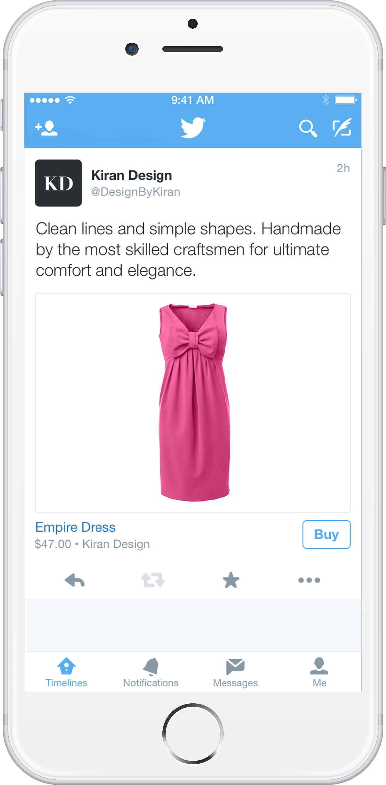
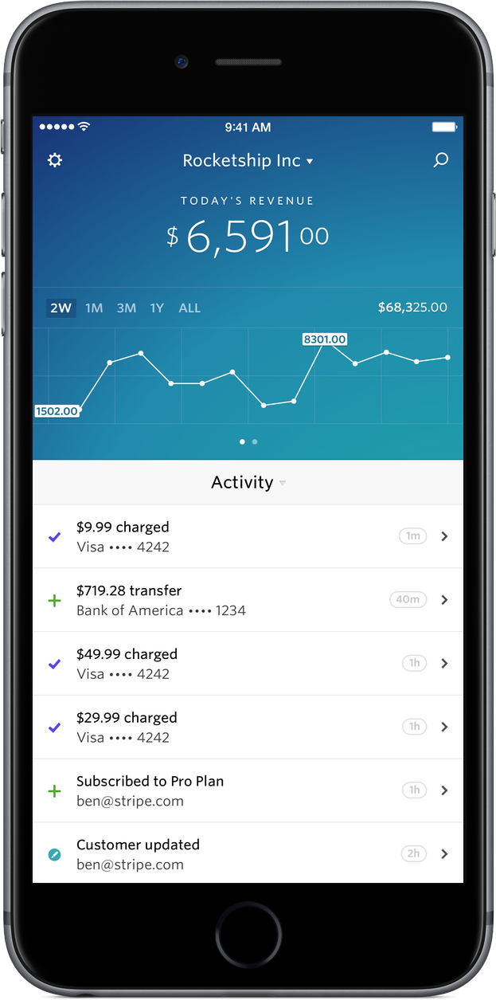
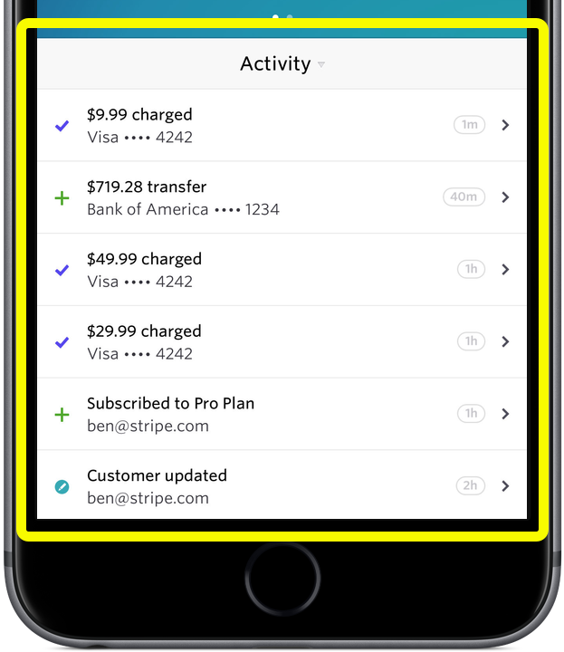
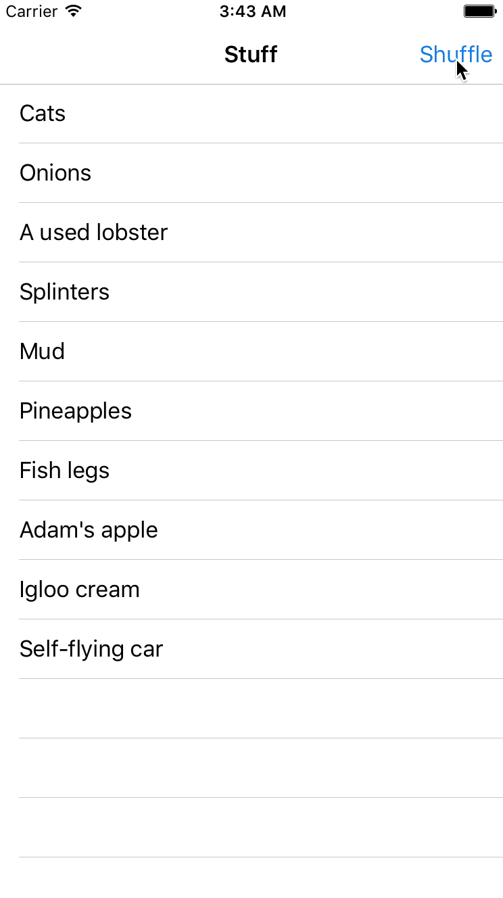

# 𝚫

^ Hi, I'm Jack Flintermann! I'm crossing a new hipster milestone for myself, and using a symbol for the title of my talk. That's because I want to talk to you about changes.

---


^ So, a very quick background on what I do. I'm an iOS engineer at a company called Stripe. We make tools for developers to accept payments online. This started with APIs to do simple credit card payments, but has expanded into a lot more. For example, marketplaces like Kickstarter and Lyft use Stripe both to charge their customers but also to pay out their project backers and drivers.

---



^ As a matter of fact, we've been lucky enough to partner with Twitter on a couple of products now. We launched a product last year called Relay that allows e-commerce platforms to sell their products directly within the Twitter app.

---


^ As Ali mentioned, we also worked with Twitter as part of their launch of third-party SDKs in Fabric. So if you're looking to integrate Stripe into your iOS app, you can do so with just a few clicks.

^ But instead of talking about these huge awesome things, I'm not really going to talk about Stripe during this talk. I hope I don't get chewed out for this. Instead, I'm going to use this huge awesome stage to talk about something really small and, honestly, kind of random-seeming. Then I'm going to talk about how we used it to build something super useful, and maybe - *just* maybe - even relevant for a talk that's supposed to be about realtime apps.

---

# `diff`

^ So yeah, that random thing is the `diff` command. You probably use diff every day - for example, if you ever review a github pull request, you're looking at the diff of a bunch of files.

---

# :raised_hands:

^ I'm curious - raise your hand if you think you know how diff works. Like, if we were in an interview, and I asked you to write it, raise your hand if your hands wouldn't get all clammy. To be very clear, until very recently, mine would. Ok, let's change that. Let's make our hands nice and dry.

---

## TWITTER -> STRIPE
## [1, 3, 5] -> [2, 3, 4]

^ Let's start with some definitions - so, like, what is diff even? Diff is a pretty simple algorithm that figures out changes. And I mean this in the most vague possible sense. You give it two sequences of values, and it will tell you the smallest possible set of transformations you need to do to turn the first sequence into the second sequence. So this might be morphing one word into another word - say, trying to morph "TWITTER" into "STRIPE". Or, just as reasonably, we might want to compare two arrays of integers.

---

# LCS

## **T**W**I**TT**E**R
## S**T**R**I**P**E**   
## **TIE**            

^ So how do you build it? It turns out, diff is directly reducible to the Longest Common Subsequence problem. This problem states, given two sequences of values, find the longest not-necessarily-consecutive subsequence that they both share. So, for example, if our two inputs are TWITTER and STRIPE, the longest common subsequence is TIE.

---

$$
LCS\left(X_{i},Y_{j}\right) =
\begin{cases}
Ø
& \mbox{ if }\ i = 0 \mbox{ or }  j = 0 \\
  \textrm{  } LCS\left(X_{i-1},Y_{j-1}\right) \frown x_{i}
& \mbox{ if } x_i = y_j \\
  \mbox{longest}\left(LCS\left(X_{i},Y_{j-1}\right),LCS\left(X_{i-1},Y_{j}\right)\right)
& \mbox{ if } x_i \ne y_j \\
\end{cases}
$$

<br>
`// I shamelessly stole this from Wikipedia`

^ So I have this terrifying LaTEX formula that I stole from Wikipedia that actually isn't that scary. We have a piecewise function, that has two inputs X and Y, for our two sequences. If X or Y is empty, we return the empty set. Duh. If not, if X or Y have the same last element, we'll return the LCS of the subset of 

---

```swift
func longer<T: Equatable>(a: [T], _ b: [T]) -> [T] {
    return a.count > b.count ? a : b
}

func lcs<T: Equatable>(x: [T], _ y: [T]) -> [T] {
    return lcs(x, y, x.count - 1, y.count - 1)
}

func lcs<T: Equatable>(x: [T], _ y: [T], _ i: Int, _ j: Int) -> [T] {
    if i == -1 || j == -1 {
        return []
    }
    if x[i] == y[j] {
        return lcs(x, y, i - 1, j - 1) + [x[i]]
    }
    return longer(lcs(x, y, i, j - 1), lcs(x, y, i - 1, j))
}

```

^ So, I have to have at least one inscrutable code slide in this talk. Don't worry, I'm not really going to go through this - the important thing to note is that this basically directly maps to the piecewise function I just showed you, and that it's not a lot of code! This is maybe 15 lines of Swift. The slides from this talk are on github if you want to read this in more detail; I'll give you the link at the end.

^ There is one neat swiftyism I have to point out - at Stripe we're really excited about Swift. You can see that all of these functions are Generic - so you can Diff two arrays of any type T, where T conforms to the Equatable protocol. So the only restriction on the elements in your sequences is that they define the == method. This might seem like NBD to the Java or Scala developers here, but coming from an objective-c background, this kind of thing makes me want to cry tears of joy.

---

## LCS -> Diff

### **T** (-W) **I** (-T) (-T) **E** (-R) -> **TIE**
### (+S) **T** (+R) **I** (+P) **E** -> S**T**R**I**P**E**

^ So, back to Diff. Remember how I said that Diff was basically the same problem as longest common subsequence? Once we have our longest common subsequence, it's actually almost trivial to get the diff of our original inputs. We can represent a "diff" between two arrays, x and y, to be two arrays: one is an array of indices to delete from x to transform it to the LCS of x and y, and the other is an array of indices to insert into the LCS to transform it into y.

---



^ OK. Remember how I told you this might actually be applicable to something at some point? Now's the time.
^ So, Stripe has an iOS dashboard app that I work on. If you have a business on Stripe, it lets you keep tabs on it in real time. You can watch, or get notified, as new payments come in and new customers sign up for your service.

---



^ Now, let's also imagine we have an API to fetch our recent activity. And this'll return an array of Event objects. Side note, we're not actually imagining anything - one thing I really like about our dashboard app is that it's built entirely off the public Stripe API, which has a lot of advantages. For one, as we add new APIs for the app, everyone benefits from them.

---

# UITableView

- `reloadData`

^ Ok, so for this event feed we use a class called `UITableView`. This class is like 60% of the UI of every iOS app. Alex and Emily used it a bunch in their see the city app.
^ It has this method, reloadData, which does exactly what it sounds like it does. We can fetch data from our server, and turn that JSON array into a bunch of row values, then tell the tableView to use these rows as its new data source, and then call reloadData on it. After writing a few apps, you basically just develop the muscle memory to do this. Like, basically every app I've written has this code in it. But, unfortunately, reloadData is kinf of a not-so-great method. It reloads the entire table, which can cause it to flicker and be slow to draw. It'll also make your user lose their scroll position.

---

# UITableView

- `insertRowsAtIndexPaths:withAnimation:`
- `deleteRowsAtIndexPaths:withAnimation:`

^ Fortunately, UITableView has some other, really verbosely-named methods - insert/delete rows at index paths with row animation. So here you'd say, I want to insert a new row at index 1, and delete a row at index 4. This sounds more like what we want! But, unfortunately, we don't have this information. All I know is, right now, I have a list of events. And I have this new list of events I just got from my server, and those two lists are different, and I want to display a nice animation that fades in any new events and fades out any old ones. If only we had a way to diff the current array of events with the new one.

---

# Wait a minute

^ But wait, we have this! We can use that lovely diff code from just a minute ago to compare our two arrays, and get a list of indices to insert and remove from array 1 to get to array 2.

---

## Dwifft

### github.com/jflinter/Dwifft

^ So it turns out this pattern is pretty awesomely reusable. We went on to open-source this library, and I've found it useful in almost every app I've worked on since. It's called Dwifft, short for Swift Diff! It contains all of the algorithms described above, as well as a few utility classes to wire this into your app really easily. Specifically, it contains a class called TableViewDiffCalculator, which wraps a UITableView. It has a property called `rows`, and when you update that property, it'll automatically calculate the diff between its previous value and animate the changes to its tableView. It's pretty neat!

---



### `bind(tableViewDiffCalculator.rows, user.recentEvents)`

^ So for the functional-reactive programming geeks in the house, this works really really well with that - you can bind your stream of changing table view rows to your TableViewDiffCalculator, and it'll Just Work.

---


# Thank you
## @jflinter

## `https://github.com/jflinter/twitter_helloworld_talk`
## `https://github.com/jflinter/dwifft`

^ Thank you all for coming! I'd be happy to answer any questions about Dwifft, or Stripe, or iOS programming, or anything else really. I'll also be hanging around after the talk.

